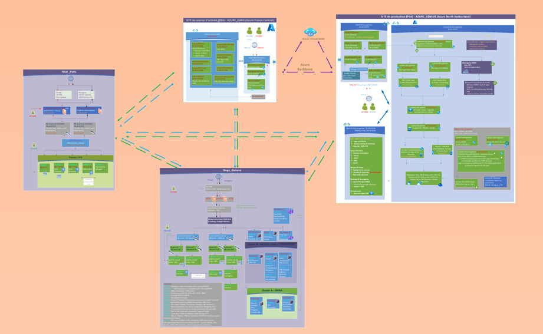

# Migration IT Paris  Genève  Azure
 
Schéma de l'infrastructure cible

Voici une vue simplifiée de l’architecture cible combinant les environnements Azure et on-premise (Genève et Paris ).

Ce projet vise à migrer l’infrastructure IT de la filiale Paris vers le siège de Genève, en tirant parti des services cloud Microsoft Azure. L’objectif est d’améliorer la résilience, la sécurité et la modernisation de l’environnement informatique, tout en garantissant une transition maîtrisée entre les infrastructures on-premise et cloud.

---

## Objectifs

- Réduire la dépendance aux infrastructures locales.
- Assurer une haute disponibilité et un plan de reprise après sinistre (PRA).
- Mettre en place une sécurité renforcée avec une approche Zero Trust.
- Automatiser le déploiement et la gestion via Terraform et Ansible.
- Mettre en place un monitoring avancé et une gestion centralisée des logs.
- Préparer l’infrastructure pour un usage hybride et évolutif.

---

## Phases du projet

1. **Étude et conception**  
   Analyse des infrastructures existantes, définition de l’architecture cible, planification des ressources Azure.

2. **Provisioning et automatisation**  
   Mise en place des scripts Terraform pour le déploiement de l’infrastructure cloud, configuration avec Ansible.

3. **Migration et bascule**  
   Transfert des services et données, tests de montée en charge, mise en place du PCA/PRA.

4. **Validation et optimisation**  
   Retour d’expérience, ajustements de la configuration, renforcement de la sécurité et du monitoring.

---

## Rôles clés

- **Chef de projet** : coordination globale, suivi des jalons.  
- **Architecte cloud** : conception de l’infrastructure Azure et intégration hybride.  
- **Ingénieur DevOps** : automatisation avec Terraform, Ansible, CI/CD.  
- **Administrateur systèmes et réseau** : gestion on-premise et interconnexion réseau.  
- **Responsable sécurité** : mise en œuvre des politiques Zero Trust et DLP.

---

## Carte des filiales

- **Siège Genève** : site principal d’hébergement on-premise, centre de contrôle du réseau.  
- **Filiale Paris** : site source de la migration, connecté via VPN sécurisé.

---

## Livrables attendus

- Documentation complète (architecture, réseaux, sécurité, monitoring).  
- Scripts d’automatisation (Terraform, Ansible).  
- Configuration Kubernetes et CI/CD.  
- Rapports de migration et de validation.  
- Plan de continuité d’activité (PCA) et de reprise après sinistre (PRA).

---

## Contact

Pour toute question ou contribution, merci de contacter le chef de projet ou l’équipe DevOps: 
Saidou DIA Duuzey@hotmail.com.

